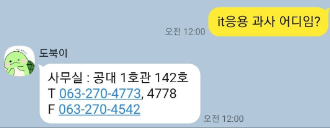
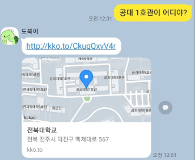
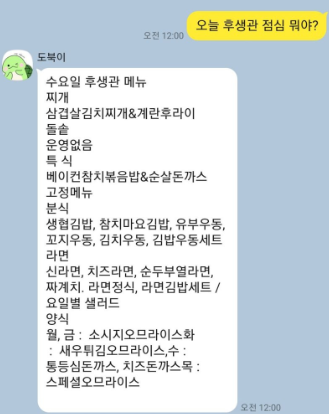

# dobbuggi
- lstm 기반 전북대학교 챗봇 도북이 프로젝트. 
- 학식,과사무실위치,건물위치,공지사항 등의 서비스를 제공합니다.

# Project Goal
- 아주 간단한 챗봇 구현
- `딥러닝`과목에서 수강한 lstm기반 아키텍쳐 사용.
- DB에서 배포까지 하나의 서비스를 관통하는 모든 프로세스 수행.
- local 서버 만들어 보기.

# 느낀점
- 처음으로 데이터부터 배포까지 하나의 서비스를 만들어보았다!
- 하나의 큰 서비스를 만들어지더닌 파일들이 점점 많아졌다.
    - 모듈,패키지를 잘 사용해서 기능별로 구분을 잘 해놓자.
- LSTM으로 텍스트를 먼저 분류하고 정해진 답변을 매핑하는 구조였다.
    - 그렇기 때문에 답변이 한정적이며 답변이 한정적이다.
    - 정말로 sequence를 생성할 수 있는 seq2seq나 transformer기반 아키텍쳐를 공부했었다면 더 좋았을 것 같다.
- 학습데이터가 충분하지 못했기에 저조한 인식률.
    - 프로젝트를 실시하기 전 항상 데이터가 충분한지 체크가 필요하다.
    - text Generation 관련 부분을 알고 있었다면 더 좋았을 것 같다.

# 주요 stack 
- python
- mysql

# Results
 
 
 

